## Universidad de San Carlos de Guatemala
## Facultad de ingeniería
## Laboratorio Sistemas Operativos 1
## Sección P
## Auxiliar: Elian Ángel Fernando Reyes Yac

### PROYECTO # 2

### Sonda de Kernel en C y Daemon en Go para la Telemetría de Contenedores
### Manual Técnico

| Nombre | Carnet |
|---|---|
| Raúl Emanuel Yat Cancinos | 202300722 |

## Introducción
El presente manual técnico documenta el desarrollo del Proyecto 2: Sonda de Kernel en C y Daemon en Go para la Telemetría de Contenedores, donde consiste en el diseño e implementación de un sistema integral para la monitorización proactiva, análisis automatizado y gestión inteligente de contenedores en entornos Linux.

El sistema se compone de tres elementos fundamentales:

1. Un módulo de kernel desarrollado en C, que actúa como un sensor de bajo nivel, accediendo directamente a las estructuras internas del kernel para capturar métricas detalladas de los procesos asociados a contenedores, así como información general del sistema (uso de RAM, CPU, etc.)

2. Un Daemon implementado en Go, que funciona como el cerebro del sistema. Su labor consiste en leer la información expuesta por el módulo de kernel a través del sistema de archivos /proc, procesarla, tomar decisiones autónomas (como la eliminación de contenedores para mantener un equilibrio de recursos) y almacenar los datos históricos para su posterior visualización

3. Un stack de visualización y almacenamiento compuesto por Valkey (base de datos en memoria de código abierto)  y Grafana (herramienta de visualización de datos), que permiten observar la evolución del sistema en tiempo real a través de un dashboard interactivo.

## Arquitectura del sistema
La arquitectura del sistema sigue un diseño modular y de capas, donde cada componente tiene una responsabilidad bien definida y se comunican de manera eficiente para lograr el objetivo de monitorización y gestión autónoma.
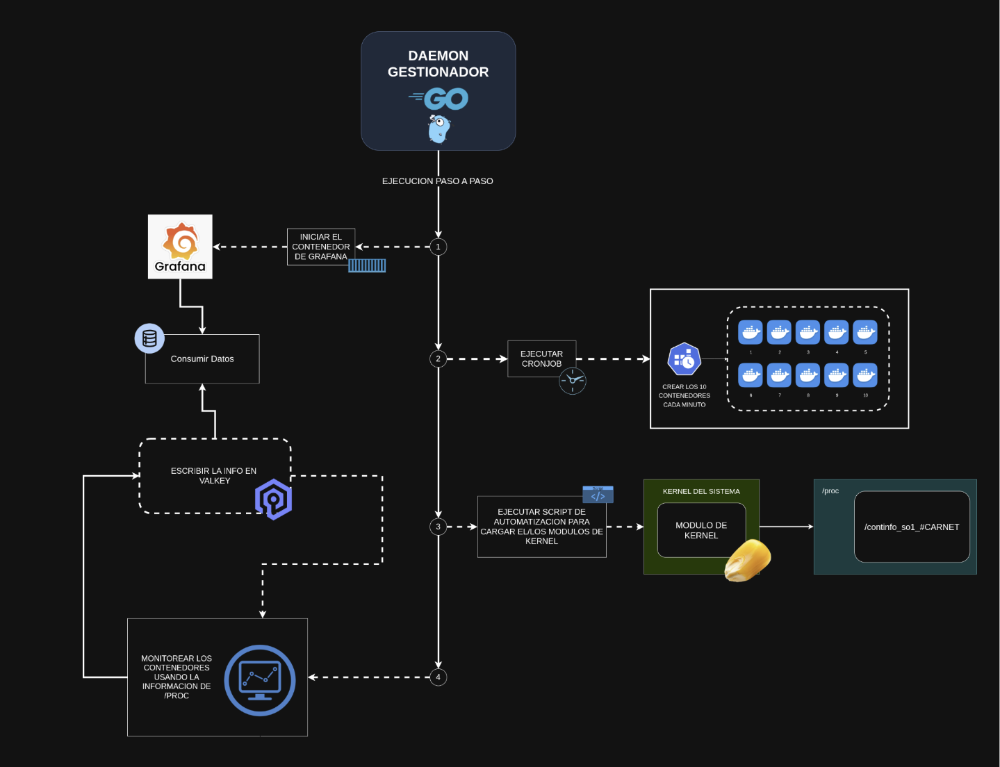

## Módulo del Kernel
Es el componente de más bajo nivel. Reside en el espacio del kernel y tiene acceso privilegiado al hardware y a las estructuras internas del sistema operativo . Su función es iterar sobre la lista de procesos del sistema utilizando la estructura task_struct, filtrar aquellos pertenecientes a contenedores, y extraer métricas clave como PID, nombre, uso de memoria virtual (VSZ), memoria residente (RSS), porcentaje de memoria y porcentaje de CPU. Esta información se exporta al espacio de usuario a través de un archivo virtual en el directorio /proc.

### Funciones principales del módulo hecho en C
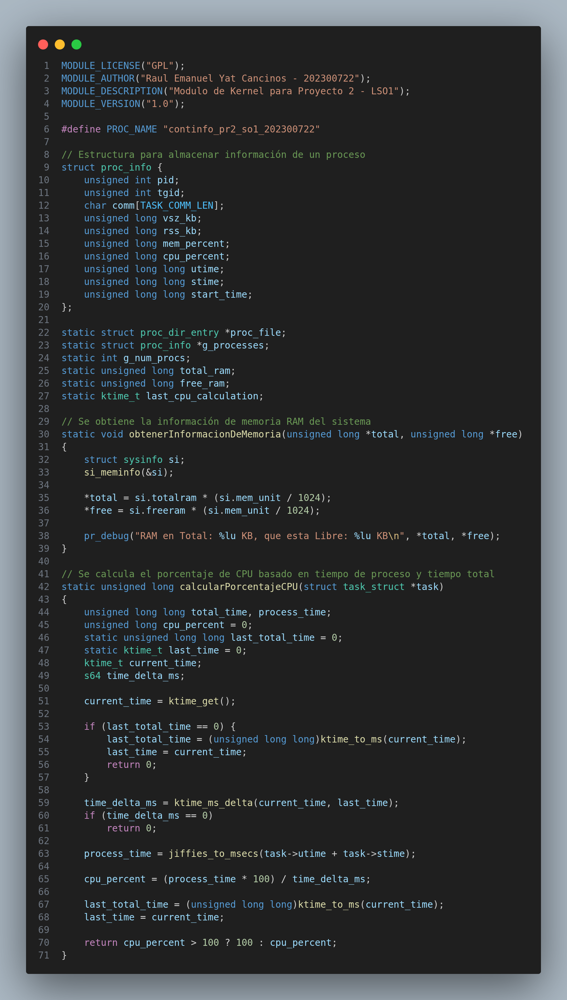

### Archivo /proc/continfo_pr2_so1_202300722
Actúa como el canal de comunicación unidireccional entre el espacio del kernel y el espacio del usuario. El módulo de kernel escribe las métricas en este archivo en un formato estructurado, y el Daemon en Go las lee periódicamente.

## Daemon en Go
Es el orquestador central. Está implementado como un servicio en segundo plano (daemon) que se ejecuta continuamente. Sus responsabilidades incluyen:

- Leer y parsear el archivo /proc.
- Analizar los datos de los contenedores (clasificándolos por consumo de RAM/CPU).
- Tomar decisiones autónomas para mantener la política definida (2 contenedores de alto consumo, 3 de bajo consumo), eliminando los contenedores sobrantes a través de la API de Docker.
- Ejecutar un cronjob interno para generar carga de trabajo variable (creando 5 contenedores de prueba cada 2 minutos).
- Almacenar las métricas procesadas (histórico de RAM, contenedores eliminados, top 5) en Valkey.

### Función donde lee y parsea el archivo /proc
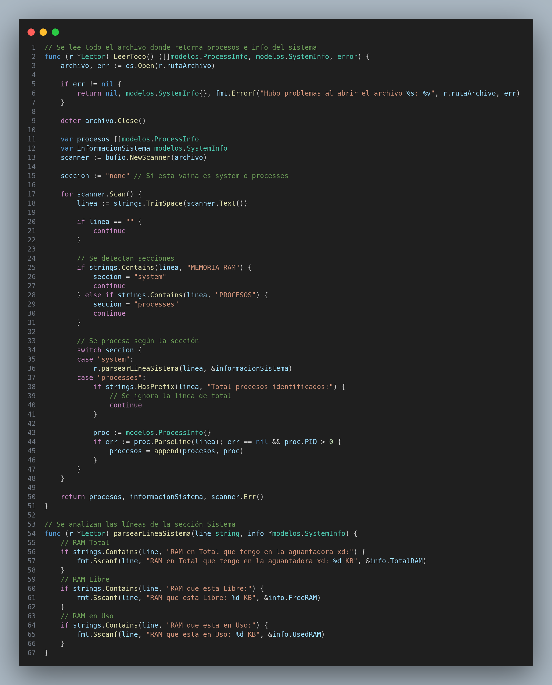

### Función donde se analizan los contenedores
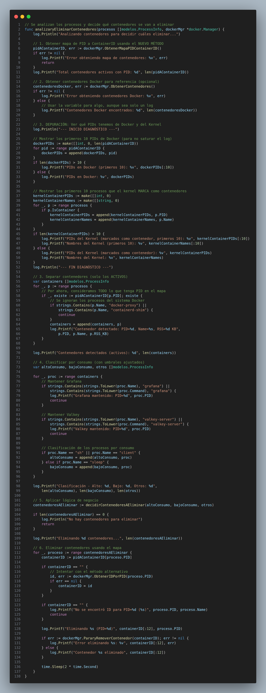

### Función donde se ejecuta el cronjob
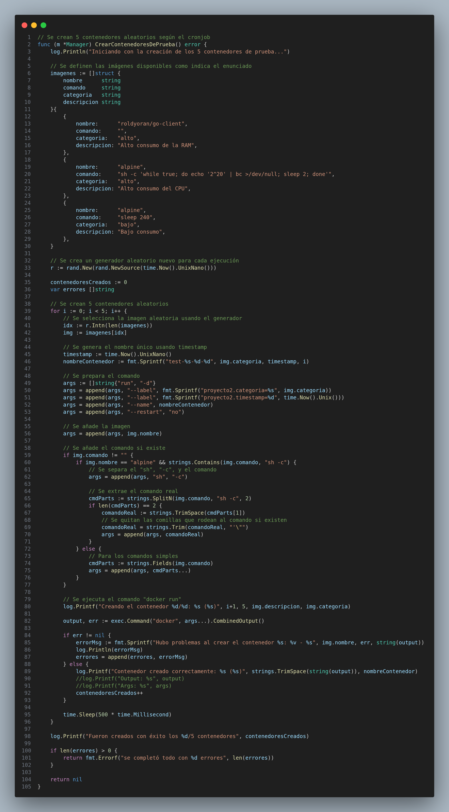

### Función donde se almacena la información en Valkey
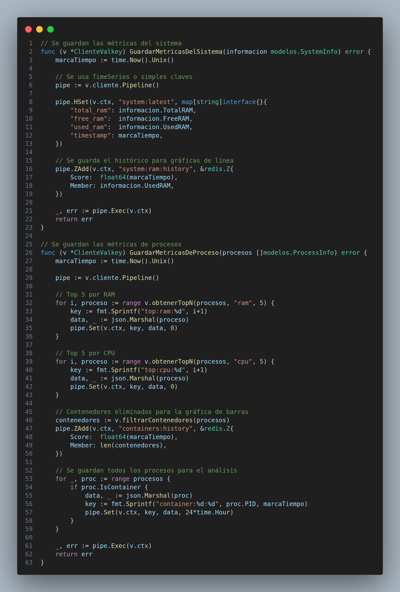

## Configuración de Valkey
Es la base de datos en memoria que actúa como el almacén de datos histórico. Su naturaleza de alta velocidad es ideal para manejar las métricas en tiempo real generadas por el Daemon. En este proyecto, Valkey almacena estructuras de datos como hashes para la información del sistema en tiempo real y sorted sets para las series temporales, permitiendo consultas eficientes para la generación de gráficos

## Configuración de Grafana
Es la herramienta de visualización de datos de código abierto. Se conecta a Valkey como fuente de datos y presenta las métricas almacenadas en un dashboard interactivo. Este dashboard incluye paneles como el uso de RAM a lo largo del tiempo, el número de contenedores eliminados, y los rankings de los 5 contenedores con mayor consumo de RAM y CPU.
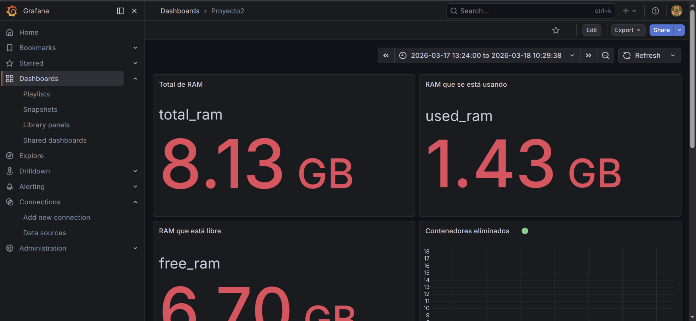
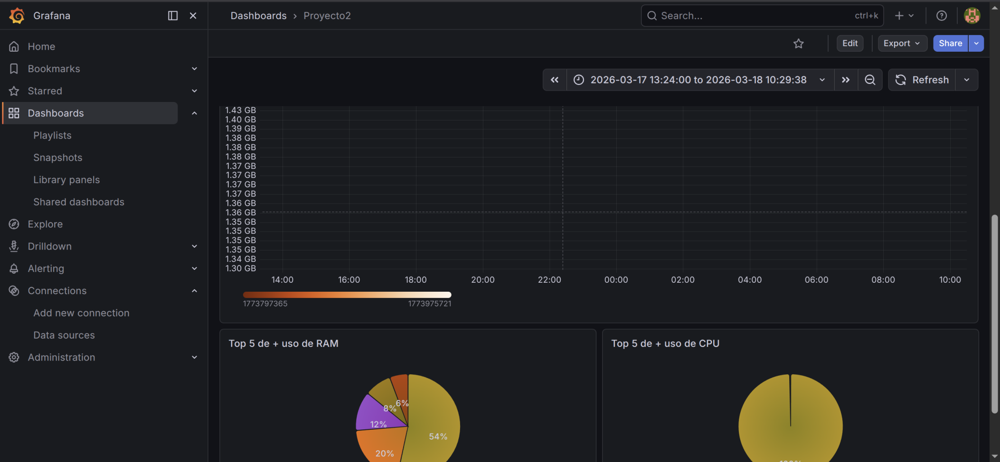

## Docker Engine
Es el entorno de ejecución de contenedores utilizado para simular la carga de trabajo. El Daemon en Go interactúa con él a través de su API para crear y eliminar contenedores de prueba (usando las imágenes roldyoran/go-client y alpine), así como para proteger al contenedor de Grafana de ser eliminado por la lógica de gestión.

## Servicio systemd
Es un gestor de sistemas y servicios para sistemas operativos Linux, y es el sistema de inicio (init) estándar en la mayoría de las distribuciones modernas, incluido Ubuntu. Es el primer proceso que se ejecuta en el espacio de usuario (con PID 1) y se encarga de arrancar y mantener el resto de los servicios del sistema. Un servicio en systemd se define mediante un archivo de unidad (.service), que especifica cómo ejecutar, detener y gestionar un programa (como el Daemon de este proyecto). Las ventajas de usar systemd incluyen la gestión de dependencias entre servicios, la capacidad de reiniciar automáticamente un servicio si falla, y el registro centralizado de logs a través de journalctl.

## Pruebas realizadas
Capturas de pruebas realizadas tanto en el Daemon como en el Módulo del Kernel pa que haya evidencia que si funkaba esta vaina y después no hayan lloros xd.
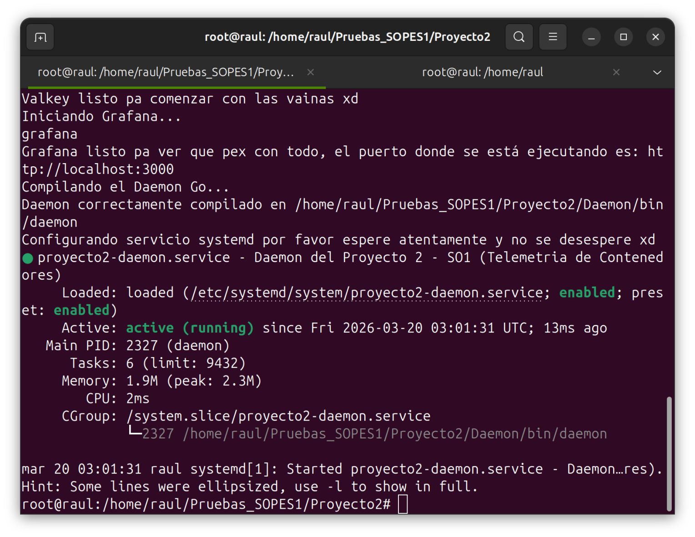
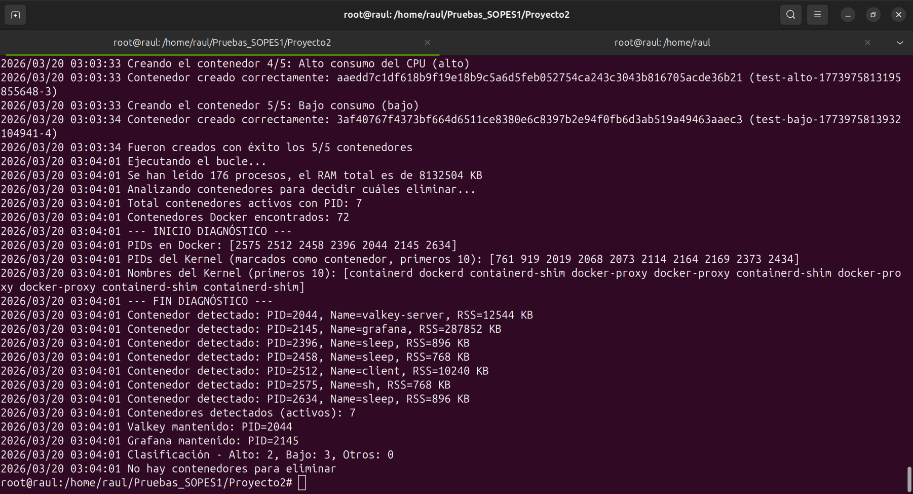
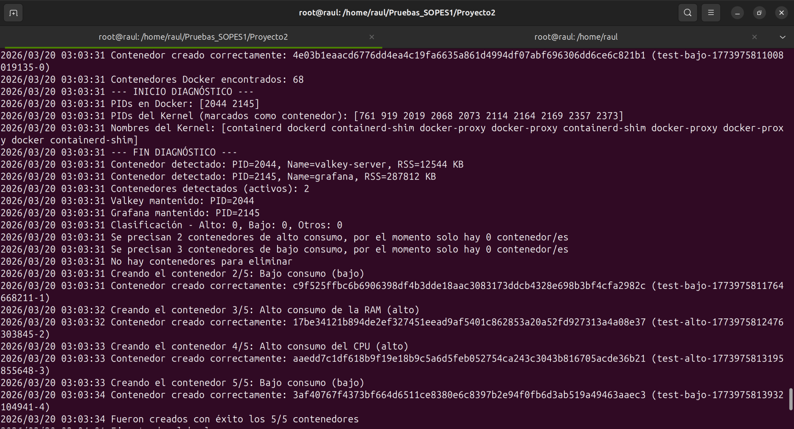
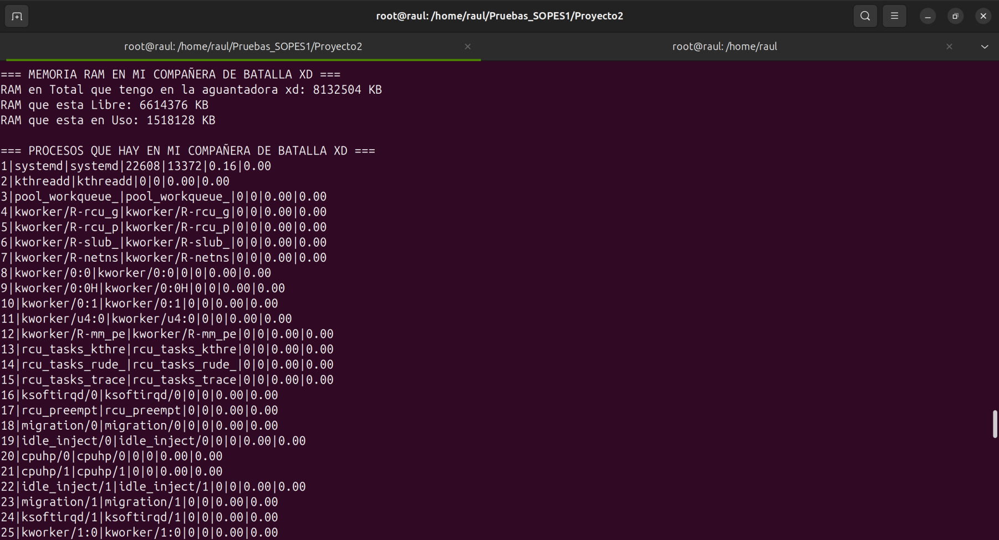
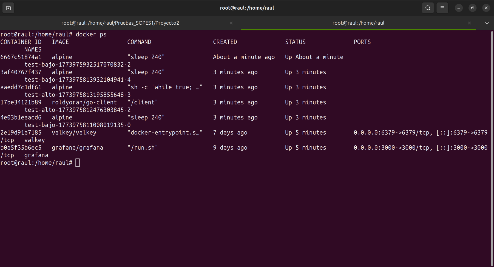
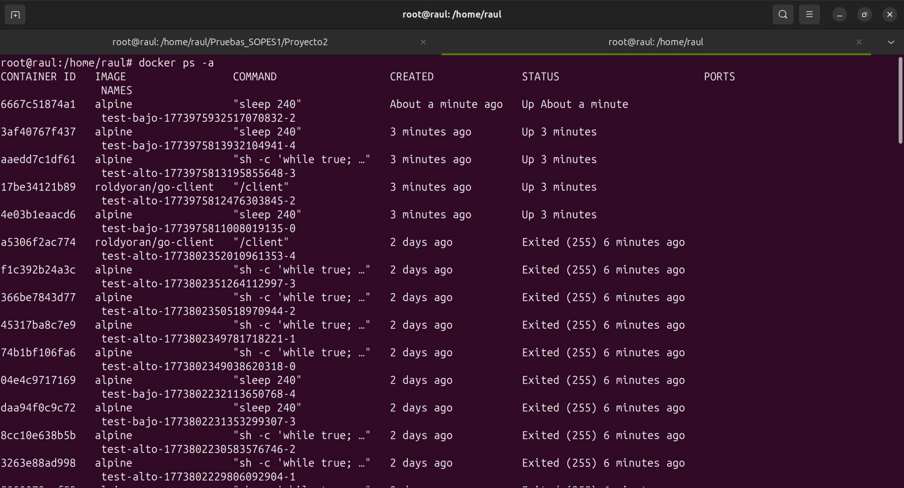