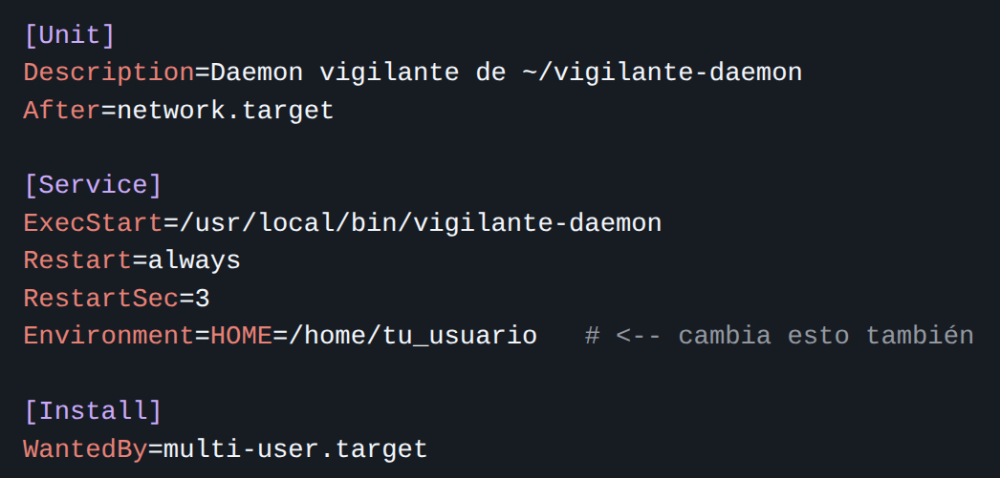

## Universidad de San Carlos de Guatemala
## Facultad de ingeniería
## Laboratorio Sistemas Operativos 1
## Sección P
## Auxiliar: Elian Ángel Fernando Reyes Yac


### PROYECTO # 2

### Sonda de Kernel en C y Daemon en Go para la Telemetría de Contenedores
### Manual de Usuario

| Nombre | Carnet |
|---|---|
| Raúl Emanuel Yat Cancinos | 202300722 |

## Introducción
Bienvenido al Manual de Usuario del Proyecto 2: Sonda de Kernel en C y Daemon en Go para la Telemetría de Contenedores.

Este sistema ha sido diseñado para ser una solución integral de monitoreo y gestión autónoma de contenedores en un entorno Linux. Su objetivo es mantener un equilibrio en el consumo de recursos del sistema, asegurando que siempre exista una cantidad determinada de contenedores de alto y bajo consumo, todo esto de manera automática y sin intervención manual.

El sistema funciona como un vigilante inteligente. Utiliza un componente de bajo nivel (un módulo de kernel) que actúa como un sensor, espiando todo lo que sucede con los procesos y contenedores en tu máquina. Esta información es leída por un programa "cerebro" (un Daemon escrito en Go) que, basado en reglas predefinidas, decide qué contenedores debe mantener y cuáles debe eliminar para optimizar el rendimiento. Finalmente, toda esta actividad se registra y se puede visualizar en tiempo real a través de un atractivo dashboard en Grafana.

Este manual está diseñado para guiarlo paso a paso a través del proceso de instalación, configuración y uso de todos los componentes del sistema, asegurando una experiencia exitosa. Asumiremos que usted tiene conocimientos básicos del uso de la terminal en Linux y de comandos como cd, ls, sudo y nano o vim.

## Requisitos del sistema
### Requisitos del hardware
- Procesador: Arquitectura x86_64 (64 bits).
- Memoria RAM: Mínimo 4 GB. Se recomiendan 8 GB para un funcionamiento fluido, especialmente considerando la ejecución de múltiples contenedores de prueba y las herramientas de visualización.
- Almacenamiento en Disco: Al menos 20 GB de espacio libre. Esto es necesario para el sistema operativo, las herramientas de desarrollo (Go, compiladores), las imágenes de Docker y los contenedores en ejecución. Se recomiendan 30 GB para mayor comodidad y para alojar datos históricos sin problemas de espacio.
- Conexión de Red: Necesaria para descargar paquetes e imágenes Docker.

### Requisitos de Software

El sistema ha sido probado y diseñado para funcionar en **Ubuntu Server 24.04 LTS**, aunque debería ser compatible con versiones recientes de otras distribuciones basadas en Debian.

A continuación, se listan los paquetes de software que deben estar instalados en el sistema antes de ejecutar el proyecto.

| Software | Versión Mínima Recomendada | Propósito | Comando de Instalación (Ubuntu/Debian) |
| :--- | :--- | :--- | :--- |
| **Sistema Operativo** | Ubuntu 24.04 LTS | Base del sistema. | - |
| **Docker Engine** | Última estable | Ejecución de contenedores de prueba y servicios (Grafana, Valkey). | `curl -fsSL https://get.docker.com -o get-docker.sh` <br/> `sudo sh get-docker.sh` |
| **Go (Golang)** | 1.22 o superior | Compilación y ejecución del Daemon. | `sudo snap install go --classic` |
| **Compilador de C (GCC)** | 13.3.0 | Compilación del módulo de kernel. | Viene con `build-essential` (`sudo apt install build-essential`) |
| **Linux Headers** | Igual que la versión del kernel | Necesarios para compilar el módulo de kernel. | `sudo apt install linux-headers-$(uname -r)` |
| **Git** | Última estable | Clonar el repositorio del proyecto (si es necesario). | `sudo apt install git` |
| **Make** | Última estable | Automatizar la compilación. | Viene con `build-essential` |
| **Valkey** | 8.0.1 (o la más reciente) | Base de datos en memoria para métricas. | Se ejecuta como contenedor Docker. |
| **Grafana** | 11.5.1 (o la más reciente) | Visualización de dashboards. | Se ejecuta como contenedor Docker. |

## Instalación paso a paso y ejecución del proyecto
### Crear y hacer funcionar el módulo del kernel en C
1. Ten acceso a los encabezados del kernel (kernel headers). En Ubuntu y sistemas basados en el mismo, puedes instalarlos con `sudo apt-get install gcc linux-headers-$(uname -r)`
2. Abre un editor de texto y copia el código proporcionado en un archivo con extensión .c, por ejemplo, sysinfo.c
3. En el mismo directorio donde guardaste sysinfo.c, crea un archivo llamado Makefile con el siguiente contenido:
obj-m += sysinfo.o

all:
   make -C /lib/modules/$(shell uname -r)/build M=$(PWD) modules

clean:
   make -C /lib/modules/$(shell uname -r)/build M=$(PWD) clean

4. En la terminal, navega al directorio donde guardaste sysinfo.c y Makefile. Luego ejecuta `make`
5. Usa insmod para cargar el módulo `sudo insmod sysinfo.ko`
6. Para verificar que el módulo se ha cargado, usa `lsmod | grep sysinfo`
7. También puedes verificar si el archivo /proc/sysinfo ha sido creado `cat /proc/sysinfo`
8. Para desinstalar el módulo se usa `sudo rmmod sysinfo`
**NOTA:** Si encuentas errores, puedes revisar los mensajes del kernel usando `dmesg | tail`

**CREDITOS:** Al Auxiliar Jose Lorenzana por la guía del módulo del kernel ya que esta guía está en su repositorio: `https://github.com/JoseLorenzana272/LAB-SO1-1S2026.git`

### Crear y ejecutar el Daemon
1. Teniendo ya todo en los archivos Go se crea una carpeta usando `mkdir ~/vigilante-daemon`
2. Se compila con el nuevo nombre usando `go build -o /usr/local/bin/vigilante-daemon main.go`
3. Se crea un archivo systemd en la ruta `/etc/systemd/system/vigilante-daemon.service` usando este código:

4. Para activar se usan los siguientes comandos `sudo systemctl daemon-reload` y `sudo systemctl enable --now vigilante-daemon`
5. Para probarlo usa lo siguiente:
```bash
# Crear, modificar y borrar archivos en la carpeta vigilada
touch ~/vigilante-daemon/prueba.txt
echo "hola" >> ~/vigilante-daemon/prueba.txt
rm ~/vigilante-daemon/prueba.txt

# Ver logs en tiempo real
tail -f /var/log/vigilante-daemon.log
```
Donde se verá lo siguiente en consola:

```
=== vigilante-daemon iniciado | Vigilando: /home/juan/vigilante-daemon ===
[CREADO]     /home/juan/vigilante-daemon/prueba.txt
[MODIFICADO] /home/juan/vigilante-daemon/prueba.txt (mod: 15:10:42)
[ELIMINADO]  /home/juan/vigilante-daemon/prueba.txt
```
6. Para apagarlo usa los siguientes comandos `sudo systemctl stop vigilante-daemon` y `sudo systemctl disable vigilante-daemon`

## Uso del sistema
Una vez que la instalación se ha completado con éxito usando el script start.sh, el sistema comenzará a funcionar de manera autónoma. Esta sección le guiará sobre cómo interactuar con él.

### Inicio del sistema
Para poner en marcha todo el sistema (módulo de kernel, contenedores y daemon), ejecute el script principal con permisos de superusuario desde el directorio raíz del proyecto:

```bash
cd /ruta/a/tu/proyecto/Proyecto2
sudo ./ejecutar.sh
```

El script realizará las siguientes acciones automáticamente:

1. Limpiará ejecuciones anteriores.
2. Compilará y cargará el módulo del kernel.
3. Verificará la correcta creación del archivo /proc/continfo_pr2_so1_202300722.
4. Iniciará los contenedores de Valkey y Grafana (los creará si no existen).
5. Compilará el Daemon en Go.
6. Configurará e iniciará el Daemon como un servicio de systemd en segundo plano.

### Para configurar Grafana
#### 1. Primera vez (crear estructura de carpetas)
mkdir -p grafana/provisioning/{datasources,dashboards}

#### 2. Crear los archivos YAML y JSON (copiar el contenido de arriba)

#### 3. Iniciar todo (servicios + daemon)
make dev

#### 4. En otra terminal, ver logs
make docker-logs

#### 5. Acceder a Grafana
#### Abre http://192.168.122.144:3000/
#### Usuario: admin
#### Contraseña: admin
#### El dashboard "Proyecto 2" ya debería estar disponible

#### 6. Cuando termines
make docker-down
make clean

## Comandos útiles
### Para observar los logs del Daemon
cat /var/log/proyecto2-daemon.log

### Para parar y eliminar contenedores
docker stop $(docker ps -a | grep -E "test-|roldyoran|alpine" | awk '{print $1}') 2>/dev/null
docker rm $(docker ps -a | grep -E "test-|roldyoran|alpine" | awk '{print $1}') 2>/dev/null

### Para revisar si Valkey lo está haciendo bien xd
#### Entrar al contenedor de Valkey
docker exec -it valkey valkey-cli

#### Dentro de valkey-cli, ver qué datos hay
KEYS *
HGETALL system:latest
ZRANGE system:ram:history 0 -1 WITHSCORES
exit

#### Para borrar los datos en Valkey
docker exec -it valkey valkey-cli DEL system:ram:history
docker exec -it valkey valkey-cli DEL system:latest

### Manera rápida
#### Verificar que los servicios están corriendo
docker-compose ps

#### Probar conexión a Valkey
redis-cli -h localhost -p 6379 ping
#### Debería responder: PONG

#### Ver logs de Grafana (para asegurar que el plugin se instaló)
docker-compose logs grafana | grep -i plugin

### Ejecutar script con los comandos
cd /home/ruloyat/Escritorio/SistemasOperativos1/202300722_LAB_SO1_1S2026/Proyecto2
bash run.sh

### Comandos para ejecutar el módulo del Kernel
#### 1. Cargar el módulo
sudo insmod modulo.ko

#### 2. Verificar que está cargado
lsmod | grep modulo

#### 3. Ver los mensajes del kernel
dmesg | tail

#### 4. Ver el archivo creado en /proc
ls -la /proc/continfo_pr2_so1_202300722

#### 5. LEER EL CONTENIDO
cat /proc/continfo_pr2_so1_202300722

#### 6. Descargar el módulo (cuando termines)
sudo rmmod modulo

### Encabezados de lo que se observa
PID|Nombre|Comando/CONTAINER|VSZ(KB)|RSS(KB)|%MEM|%CPU
7770|cat  |              cat|5920   |1700   |0.01|0.00